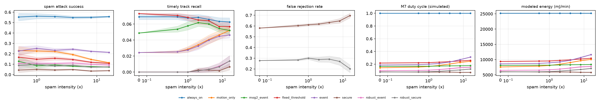
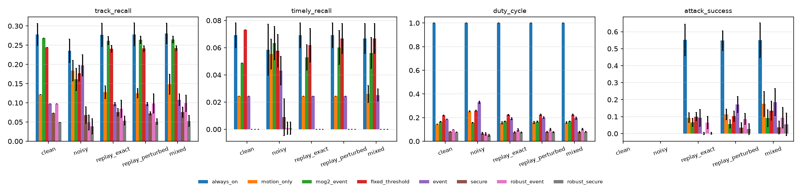

# R2 results: real-detector-trace study (test split)

Generated by `scripts/r2/make_report_r2.py` from stored CSV/JSON outputs. Detector predictions, boxes and mAP are REAL; watcher features are computed from REAL frames; M7 timing, RPC, wake-up and all power values are SIMULATED (uncalibrated, `config/power_model.json`). Energy is MODELED.

## Campaign

* `main`: 6000 runs (8 modes x 5 scenario(s) x 1 intensity(ies) x 30 seeds x 5 test segments), frozen parameters SHA-256 `84e8712f653201dd...` committed in `714870b`.
* `sweep`: 8400 runs (8 modes x 1 scenario(s) x 7 intensity(ies) x 30 seeds x 5 test segments), frozen parameters SHA-256 `84e8712f653201dd...` committed in `714870b`.
* Frozen parameter file: `results/r2/frozen_params.json` (SHA-256 `84e8712f653201dd88a23cf4e6e11da88f687d7b595953e5937d001e57e0dc9e`), tuned on the validation split only (`docs/PREREGISTERED_R2_ANALYSIS.md`, amendment 1 included).
* Test split: KITTI tracking static-camera segments 0012 (0-77), 0015 (90-375), 0016 (0-208), 0019 (618-706), 0019 (1003-1052): 712 real frames, 41 moving tracks (35 in bursts).

## Confirmatory hypotheses (pre-registered, Holm over C1-C8, C10, C11; C9 non-inferiority)

| id | scenario | metric | comparison | mean A | mean B | mean diff [95% CI] | rank-biserial | non-zero pairs | p (Holm) | verdict |
|---|---|---|---|---|---|---|---|---|---|---|
| C1 | noisy | timely_recall | robust_event vs event | 0.001 | 0.043 | -0.042 [-0.046, -0.038] | -1.00 | 30 | 2.38e-06 | **NOT CONFIRMED** |
| C2 | noisy | track_recall | robust_event vs event | 0.049 | 0.198 | -0.149 [-0.163, -0.135] | -1.00 | 30 | 4.89e-06 | **NOT CONFIRMED** |
| C3 | noisy | burst_timely_recall | robust_event vs event | 0.001 | 0.050 | -0.050 [-0.054, -0.045] | -1.00 | 30 | 2.38e-06 | **NOT CONFIRMED** |
| C4 | mixed | burst_timely_recall | robust_secure vs secure | 0.000 | 0.000 | 0.000 [0.000, 0.000] | 0.00 | 0 | n/a | **NOT CONFIRMED** |
| C5 | replay_exact | replay_exact_success | robust_secure vs secure | 0.002 | 0.001 | 0.000 [-0.003, 0.004] | 0.00 | 3 | n/a | **NOT CONFIRMED** |
| C6 | replay_perturbed | replay_pert_success | robust_secure vs secure | 0.026 | 0.035 | -0.009 [-0.025, 0.007] | -0.30 | 20 | 0.245 | **NOT CONFIRMED** |
| C7 | spam x8 | frr | robust_secure vs secure | 0.270 | 0.648 | -0.378 [-0.423, -0.332] | -1.00 | 30 | 1.49e-08 | **CONFIRMED** |
| C8 | spam x8 | timely_recall | robust_secure vs secure | 0.007 | 0.002 | 0.005 [-0.000, 0.010] | 0.60 | 10 | 0.219 | **NOT CONFIRMED** |
| C9 | spam x8 | spam_success | robust_secure vs secure | 0.072 | 0.034 | 0.038 [0.029, 0.047] | 0.98 | 29 | n/a (CI rule) | **CONFIRMED** |
| C10 | noisy | duty_cycle | robust_event vs always_on | 0.061 | 1.000 | -0.939 [-0.943, -0.934] | -1.00 | 30 | 1.49e-08 | **CONFIRMED** |
| C11 | noisy | energy_mJ | robust_event vs always_on | 6626 | 29912 | -23286 [-23405, -23168] | -1.00 | 30 | 1.49e-08 | **CONFIRMED** |

### Clean (no overlay; seeds differ only in simulated timing; descriptive): mean ± SD over 30 realizations

| method | track_recall | timely_recall | burst_recall | duty_cycle | energy_per_min_mJ | attack_success | frr |
|---|---|---|---|---|---|---|---|
| always_on | 0.278 ± 0.028 | 0.069 ± 0.009 | 0.260 ± 0.026 | 1.000 ± 0.000 | 25181 ± 2 | n/a | n/a |
| motion_only | 0.122 ± 0.000 | 0.024 ± 0.000 | 0.143 ± 0.000 | 0.144 ± 0.002 | 7593 ± 55 | n/a | n/a |
| mog2_event | 0.268 ± 0.000 | 0.049 ± 0.000 | 0.257 ± 0.000 | 0.165 ± 0.002 | 8110 ± 58 | n/a | n/a |
| fixed_threshold | 0.244 ± 0.000 | 0.073 ± 0.000 | 0.229 ± 0.000 | 0.218 ± 0.003 | 9386 ± 69 | n/a | n/a |
| event | 0.098 ± 0.000 | 0.024 ± 0.000 | 0.114 ± 0.000 | 0.186 ± 0.002 | 8607 ± 56 | n/a | n/a |
| secure | 0.073 ± 0.000 | 0.000 ± 0.000 | 0.086 ± 0.000 | 0.080 ± 0.001 | 6035 ± 28 | n/a | 0.581 ± 0.000 |
| robust_event | 0.098 ± 0.000 | 0.000 ± 0.000 | 0.086 ± 0.000 | 0.098 ± 0.001 | 6473 ± 17 | n/a | n/a |
| robust_secure | 0.049 ± 0.000 | 0.000 ± 0.000 | 0.057 ± 0.000 | 0.077 ± 0.001 | 5963 ± 19 | n/a | 0.278 ± 0.000 |

### Noisy camera: mean ± SD over 30 realizations

| method | track_recall | timely_recall | burst_recall | duty_cycle | energy_per_min_mJ | attack_success | frr |
|---|---|---|---|---|---|---|---|
| always_on | 0.236 ± 0.030 | 0.059 ± 0.019 | 0.205 ± 0.033 | 1.000 ± 0.000 | 25207 ± 3 | n/a | n/a |
| motion_only | 0.184 ± 0.027 | 0.055 ± 0.011 | 0.150 ± 0.024 | 0.253 ± 0.004 | 10246 ± 95 | n/a | n/a |
| mog2_event | 0.161 ± 0.029 | 0.063 ± 0.012 | 0.146 ± 0.029 | 0.157 ± 0.003 | 7916 ± 68 | n/a | n/a |
| fixed_threshold | 0.177 ± 0.020 | 0.058 ± 0.012 | 0.151 ± 0.023 | 0.258 ± 0.004 | 10377 ± 104 | n/a | n/a |
| event | 0.198 ± 0.027 | 0.043 ± 0.010 | 0.171 ± 0.031 | 0.330 ± 0.010 | 12090 ± 244 | n/a | n/a |
| secure | 0.068 ± 0.022 | 0.009 ± 0.014 | 0.075 ± 0.025 | 0.068 ± 0.009 | 5750 ± 207 | n/a | 0.803 ± 0.024 |
| robust_event | 0.049 ± 0.019 | 0.001 ± 0.004 | 0.049 ± 0.015 | 0.061 ± 0.011 | 5583 ± 268 | n/a | n/a |
| robust_secure | 0.039 ± 0.020 | 0.001 ± 0.004 | 0.038 ± 0.016 | 0.050 ± 0.007 | 5318 ± 179 | n/a | 0.186 ± 0.098 |

### Mixed attack (spam + replay, x1): mean ± SD over 30 realizations

| method | track_recall | timely_recall | burst_recall | duty_cycle | energy_per_min_mJ | attack_success | frr |
|---|---|---|---|---|---|---|---|
| always_on | 0.280 ± 0.027 | 0.067 ± 0.011 | 0.261 ± 0.023 | 1.000 ± 0.000 | 25182 ± 3 | 0.551 ± 0.102 | n/a |
| motion_only | 0.149 ± 0.026 | 0.026 ± 0.006 | 0.152 ± 0.019 | 0.158 ± 0.008 | 7942 ± 183 | 0.175 ± 0.073 | n/a |
| mog2_event | 0.265 ± 0.008 | 0.056 ± 0.011 | 0.253 ± 0.010 | 0.167 ± 0.003 | 8167 ± 66 | 0.091 ± 0.050 | n/a |
| fixed_threshold | 0.242 ± 0.006 | 0.067 ± 0.011 | 0.227 ± 0.007 | 0.224 ± 0.006 | 9537 ± 150 | 0.135 ± 0.055 | n/a |
| event | 0.108 ± 0.015 | 0.025 ± 0.004 | 0.120 ± 0.012 | 0.195 ± 0.009 | 8816 ± 216 | 0.186 ± 0.080 | n/a |
| secure | 0.076 ± 0.013 | 0.000 ± 0.000 | 0.089 ± 0.016 | 0.077 ± 0.007 | 5973 ± 162 | 0.036 ± 0.038 | 0.596 ± 0.029 |
| robust_event | 0.099 ± 0.021 | 0.000 ± 0.000 | 0.087 ± 0.016 | 0.102 ± 0.008 | 6573 ± 189 | 0.093 ± 0.060 | n/a |
| robust_secure | 0.053 ± 0.014 | 0.000 ± 0.000 | 0.057 ± 0.008 | 0.079 ± 0.004 | 6019 ± 107 | 0.055 ± 0.067 | 0.257 ± 0.082 |

### Exact replay: mean ± SD over 30 realizations

| method | track_recall | timely_recall | burst_recall | duty_cycle | energy_per_min_mJ | attack_success | frr |
|---|---|---|---|---|---|---|---|
| always_on | 0.277 ± 0.030 | 0.069 ± 0.009 | 0.259 ± 0.030 | 1.000 ± 0.000 | 25183 ± 3 | 0.552 ± 0.093 | n/a |
| motion_only | 0.128 ± 0.017 | 0.024 ± 0.000 | 0.144 ± 0.014 | 0.155 ± 0.009 | 7860 ± 226 | 0.094 ± 0.029 | n/a |
| mog2_event | 0.262 ± 0.011 | 0.053 ± 0.009 | 0.250 ± 0.013 | 0.167 ± 0.003 | 8167 ± 84 | 0.067 ± 0.023 | n/a |
| fixed_threshold | 0.241 ± 0.008 | 0.062 ± 0.012 | 0.226 ± 0.009 | 0.223 ± 0.004 | 9517 ± 107 | 0.100 ± 0.024 | n/a |
| event | 0.097 ± 0.004 | 0.024 ± 0.000 | 0.113 ± 0.005 | 0.190 ± 0.008 | 8711 ± 203 | 0.093 ± 0.050 | n/a |
| secure | 0.076 ± 0.010 | 0.000 ± 0.000 | 0.089 ± 0.012 | 0.077 ± 0.005 | 5956 ± 133 | 0.001 ± 0.007 | 0.575 ± 0.023 |
| robust_event | 0.085 ± 0.023 | 0.000 ± 0.000 | 0.078 ± 0.017 | 0.096 ± 0.011 | 6414 ± 263 | 0.065 ± 0.036 | n/a |
| robust_secure | 0.054 ± 0.012 | 0.000 ± 0.000 | 0.060 ± 0.009 | 0.074 ± 0.004 | 5900 ± 96 | 0.002 ± 0.006 | 0.178 ± 0.132 |

### Perturbed replay: mean ± SD over 30 realizations

| method | track_recall | timely_recall | burst_recall | duty_cycle | energy_per_min_mJ | attack_success | frr |
|---|---|---|---|---|---|---|---|
| always_on | 0.278 ± 0.030 | 0.069 ± 0.009 | 0.260 ± 0.029 | 1.000 ± 0.000 | 25182 ± 2 | 0.548 ± 0.058 | n/a |
| motion_only | 0.125 ± 0.012 | 0.024 ± 0.000 | 0.145 ± 0.013 | 0.159 ± 0.009 | 7950 ± 221 | 0.113 ± 0.031 | n/a |
| mog2_event | 0.264 ± 0.009 | 0.060 ± 0.012 | 0.252 ± 0.011 | 0.166 ± 0.004 | 8140 ± 86 | 0.057 ± 0.025 | n/a |
| fixed_threshold | 0.241 ± 0.007 | 0.067 ± 0.011 | 0.226 ± 0.009 | 0.224 ± 0.006 | 9537 ± 142 | 0.102 ± 0.030 | n/a |
| event | 0.097 ± 0.004 | 0.024 ± 0.000 | 0.113 ± 0.005 | 0.199 ± 0.007 | 8927 ± 173 | 0.171 ± 0.047 | n/a |
| secure | 0.072 ± 0.004 | 0.000 ± 0.000 | 0.085 ± 0.005 | 0.078 ± 0.005 | 5993 ± 123 | 0.035 ± 0.030 | 0.592 ± 0.020 |
| robust_event | 0.098 ± 0.025 | 0.000 ± 0.000 | 0.088 ± 0.018 | 0.102 ± 0.009 | 6554 ± 214 | 0.086 ± 0.032 | n/a |
| robust_secure | 0.051 ± 0.007 | 0.000 ± 0.000 | 0.058 ± 0.005 | 0.077 ± 0.005 | 5973 ± 122 | 0.026 ± 0.032 | 0.221 ± 0.100 |

### Trigger spam x8: mean ± SD over 30 realizations

| method | track_recall | timely_recall | burst_recall | duty_cycle | energy_per_min_mJ | attack_success | frr |
|---|---|---|---|---|---|---|---|
| always_on | 0.289 ± 0.031 | 0.063 ± 0.012 | 0.268 ± 0.033 | 1.000 ± 0.000 | 25182 ± 2 | 0.550 ± 0.029 | n/a |
| motion_only | 0.245 ± 0.021 | 0.046 ± 0.015 | 0.224 ± 0.019 | 0.228 ± 0.009 | 9639 ± 220 | 0.146 ± 0.021 | n/a |
| mog2_event | 0.258 ± 0.021 | 0.054 ± 0.012 | 0.245 ± 0.025 | 0.175 ± 0.003 | 8349 ± 85 | 0.077 ± 0.018 | n/a |
| fixed_threshold | 0.245 ± 0.008 | 0.057 ± 0.013 | 0.230 ± 0.009 | 0.251 ± 0.006 | 10198 ± 156 | 0.119 ± 0.020 | n/a |
| event | 0.202 ± 0.033 | 0.045 ± 0.009 | 0.180 ± 0.031 | 0.272 ± 0.015 | 10677 ± 351 | 0.224 ± 0.019 | n/a |
| secure | 0.103 ± 0.030 | 0.002 ± 0.006 | 0.109 ± 0.029 | 0.072 ± 0.008 | 5839 ± 200 | 0.034 ± 0.012 | 0.648 ± 0.058 |
| robust_event | 0.138 ± 0.040 | 0.007 ± 0.011 | 0.112 ± 0.033 | 0.145 ± 0.021 | 7615 ± 519 | 0.099 ± 0.022 | n/a |
| robust_secure | 0.094 ± 0.036 | 0.007 ± 0.011 | 0.085 ± 0.030 | 0.110 ± 0.014 | 6756 ± 328 | 0.072 ± 0.019 | 0.270 ± 0.096 |

## Spam-intensity sweep (S2): mean over 30 realizations

**spam_success**

| method | 0x | 0.5x | 1x | 2x | 4x | 8x | 16x |
|---|---|---|---|---|---|---|---|
| always_on | n/a | 0.553 | 0.562 | 0.558 | 0.549 | 0.550 | 0.557 |
| motion_only | n/a | 0.232 | 0.227 | 0.222 | 0.193 | 0.146 | 0.115 |
| mog2_event | n/a | 0.129 | 0.085 | 0.094 | 0.081 | 0.077 | 0.073 |
| fixed_threshold | n/a | 0.168 | 0.148 | 0.157 | 0.145 | 0.119 | 0.108 |
| event | n/a | 0.227 | 0.253 | 0.234 | 0.244 | 0.224 | 0.214 |
| secure | n/a | 0.044 | 0.050 | 0.045 | 0.049 | 0.034 | 0.038 |
| robust_event | n/a | 0.108 | 0.110 | 0.106 | 0.112 | 0.099 | 0.093 |
| robust_secure | n/a | 0.088 | 0.098 | 0.084 | 0.090 | 0.072 | 0.075 |

**timely_recall**

| method | 0x | 0.5x | 1x | 2x | 4x | 8x | 16x |
|---|---|---|---|---|---|---|---|
| always_on | 0.069 | 0.069 | 0.067 | 0.068 | 0.066 | 0.063 | 0.063 |
| motion_only | 0.024 | 0.025 | 0.028 | 0.034 | 0.041 | 0.046 | 0.052 |
| mog2_event | 0.049 | 0.054 | 0.058 | 0.062 | 0.060 | 0.054 | 0.052 |
| fixed_threshold | 0.073 | 0.071 | 0.068 | 0.065 | 0.064 | 0.057 | 0.057 |
| event | 0.024 | 0.025 | 0.028 | 0.033 | 0.040 | 0.045 | 0.046 |
| secure | 0.000 | 0.000 | 0.000 | 0.002 | 0.002 | 0.002 | 0.007 |
| robust_event | 0.000 | 0.000 | 0.000 | 0.002 | 0.003 | 0.007 | 0.014 |
| robust_secure | 0.000 | 0.000 | 0.000 | 0.002 | 0.003 | 0.007 | 0.014 |

**track_recall**

| method | 0x | 0.5x | 1x | 2x | 4x | 8x | 16x |
|---|---|---|---|---|---|---|---|
| always_on | 0.278 | 0.276 | 0.280 | 0.283 | 0.291 | 0.289 | 0.302 |
| motion_only | 0.122 | 0.148 | 0.172 | 0.202 | 0.226 | 0.245 | 0.237 |
| mog2_event | 0.268 | 0.268 | 0.268 | 0.269 | 0.267 | 0.258 | 0.250 |
| fixed_threshold | 0.244 | 0.244 | 0.244 | 0.242 | 0.242 | 0.245 | 0.242 |
| event | 0.098 | 0.107 | 0.121 | 0.153 | 0.171 | 0.202 | 0.222 |
| secure | 0.073 | 0.072 | 0.076 | 0.089 | 0.091 | 0.103 | 0.093 |
| robust_event | 0.098 | 0.105 | 0.108 | 0.116 | 0.133 | 0.138 | 0.129 |
| robust_secure | 0.049 | 0.054 | 0.060 | 0.070 | 0.089 | 0.094 | 0.104 |

**frr**

| method | 0x | 0.5x | 1x | 2x | 4x | 8x | 16x |
|---|---|---|---|---|---|---|---|
| always_on | n/a | n/a | n/a | n/a | n/a | n/a | n/a |
| motion_only | n/a | n/a | n/a | n/a | n/a | n/a | n/a |
| mog2_event | n/a | n/a | n/a | n/a | n/a | n/a | n/a |
| fixed_threshold | n/a | n/a | n/a | n/a | n/a | n/a | n/a |
| event | n/a | n/a | n/a | n/a | n/a | n/a | n/a |
| secure | 0.581 | 0.603 | 0.612 | 0.618 | 0.633 | 0.648 | 0.698 |
| robust_event | n/a | n/a | n/a | n/a | n/a | n/a | n/a |
| robust_secure | 0.278 | 0.284 | 0.300 | 0.287 | 0.291 | 0.270 | 0.201 |

**duty_cycle**

| method | 0x | 0.5x | 1x | 2x | 4x | 8x | 16x |
|---|---|---|---|---|---|---|---|
| always_on | 1.000 | 1.000 | 1.000 | 1.000 | 1.000 | 1.000 | 1.000 |
| motion_only | 0.144 | 0.154 | 0.164 | 0.180 | 0.203 | 0.228 | 0.245 |
| mog2_event | 0.165 | 0.167 | 0.168 | 0.171 | 0.174 | 0.175 | 0.177 |
| fixed_threshold | 0.218 | 0.223 | 0.224 | 0.232 | 0.240 | 0.251 | 0.261 |
| event | 0.186 | 0.193 | 0.200 | 0.212 | 0.234 | 0.272 | 0.311 |
| secure | 0.080 | 0.076 | 0.075 | 0.076 | 0.076 | 0.072 | 0.071 |
| robust_event | 0.098 | 0.101 | 0.106 | 0.115 | 0.129 | 0.145 | 0.151 |
| robust_secure | 0.077 | 0.079 | 0.082 | 0.088 | 0.100 | 0.110 | 0.124 |

**energy_per_min_mJ**

| method | 0x | 0.5x | 1x | 2x | 4x | 8x | 16x |
|---|---|---|---|---|---|---|---|
| always_on | 25181 | 25181 | 25181 | 25181 | 25181 | 25182 | 25181 |
| motion_only | 7593 | 7850 | 8079 | 8484 | 9033 | 9639 | 10055 |
| mog2_event | 8110 | 8165 | 8176 | 8252 | 8318 | 8349 | 8398 |
| fixed_threshold | 9386 | 9509 | 9551 | 9743 | 9924 | 10198 | 10434 |
| event | 8607 | 8764 | 8940 | 9228 | 9770 | 10677 | 11631 |
| secure | 6035 | 5942 | 5927 | 5942 | 5938 | 5839 | 5822 |
| robust_event | 6473 | 6546 | 6665 | 6890 | 7230 | 7615 | 7765 |
| robust_secure | 5963 | 6009 | 6077 | 6241 | 6512 | 6756 | 7094 |

**mean_trigger_latency_ms**

| method | 0x | 0.5x | 1x | 2x | 4x | 8x | 16x |
|---|---|---|---|---|---|---|---|
| always_on | n/a | n/a | n/a | n/a | n/a | n/a | n/a |
| motion_only | 264 | 264 | 264 | 264 | 264 | 264 | 264 |
| mog2_event | 263 | 263 | 263 | 262 | 263 | 263 | 263 |
| fixed_threshold | 264 | 264 | 264 | 264 | 264 | 264 | 264 |
| event | 215 | 215 | 215 | 214 | 215 | 214 | 217 |
| secure | 220 | 219 | 219 | 219 | 217 | 214 | 216 |
| robust_event | 201 | 199 | 200 | 203 | 205 | 209 | 216 |
| robust_secure | 212 | 212 | 212 | 213 | 216 | 216 | 218 |




## Replay detection per perturbation (S4, replay_exact + replay_perturbed test workloads)

| method | variant | replay frames | reached gate | blocked by gate | blocked as REPLAY | gate detection rate | attack success (reached M7) |
|---|---|---|---|---|---|---|---|
| robust_event | 0 exact | 1442 | 0 | 0 | 0 | n/a | 0.066 |
| robust_event | 1 brightness_0.85 | 281 | 0 | 0 | 0 | n/a | 0.078 |
| robust_event | 2 brightness_1.15 | 239 | 0 | 0 | 0 | n/a | 0.100 |
| robust_event | 3 noise_6 | 169 | 0 | 0 | 0 | n/a | 0.065 |
| robust_event | 4 jpeg_40 | 208 | 0 | 0 | 0 | n/a | 0.072 |
| robust_event | 5 shift_+3_+2 | 264 | 0 | 0 | 0 | n/a | 0.095 |
| robust_event | 6 brightness_1.1+noise_4+jpeg_60 | 177 | 0 | 0 | 0 | n/a | 0.085 |
| robust_event | 7 shift_-4_0+noise_3 | 130 | 0 | 0 | 0 | n/a | 0.123 |
| robust_secure | 0 exact | 1442 | 95 | 93 | 93 | 0.979 | 0.001 |
| robust_secure | 1 brightness_0.85 | 281 | 22 | 19 | 19 | 0.864 | 0.011 |
| robust_secure | 2 brightness_1.15 | 239 | 24 | 24 | 24 | 1.000 | 0.000 |
| robust_secure | 3 noise_6 | 169 | 11 | 11 | 11 | 1.000 | 0.000 |
| robust_secure | 4 jpeg_40 | 208 | 15 | 14 | 14 | 0.933 | 0.005 |
| robust_secure | 5 shift_+3_+2 | 264 | 25 | 5 | 5 | 0.200 | 0.076 |
| robust_secure | 6 brightness_1.1+noise_4+jpeg_60 | 177 | 15 | 13 | 12 | 0.867 | 0.011 |
| robust_secure | 7 shift_-4_0+noise_3 | 130 | 16 | 4 | 3 | 0.250 | 0.092 |
| secure | 0 exact | 1442 | 138 | 137 | 37 | 0.993 | 0.001 |
| secure | 1 brightness_0.85 | 281 | 60 | 49 | 18 | 0.817 | 0.039 |
| secure | 2 brightness_1.15 | 239 | 53 | 44 | 15 | 0.830 | 0.038 |
| secure | 3 noise_6 | 169 | 11 | 9 | 4 | 0.818 | 0.012 |
| secure | 4 jpeg_40 | 208 | 18 | 17 | 5 | 0.944 | 0.005 |
| secure | 5 shift_+3_+2 | 264 | 44 | 33 | 8 | 0.750 | 0.042 |
| secure | 6 brightness_1.1+noise_4+jpeg_60 | 177 | 32 | 25 | 7 | 0.781 | 0.040 |
| secure | 7 shift_-4_0+noise_3 | 130 | 19 | 11 | 3 | 0.579 | 0.062 |

robust_secure: legitimate requests at the gate 1915, blocked 409 (FRR 0.214), of which blocked as REPLAY 404.

secure: legitimate requests at the gate 3560, blocked 2078 (FRR 0.584), of which blocked as REPLAY 276.

## Component ablations (S3, exploratory, test split, frozen parameters)

| method | ablation | condition | track recall | timely recall | duty | attack success | FRR |
|---|---|---|---|---|---|---|---|
| robust_event | basic_frontend | mixed@1 | 0.101 | 0.000 | 0.106 | 0.112 | n/a |
| robust_event | basic_frontend | noisy@1 | 0.077 | 0.008 | 0.100 | n/a | n/a |
| robust_event | basic_frontend | replay_perturbed@1 | 0.098 | 0.000 | 0.105 | 0.105 | n/a |
| robust_event | basic_frontend | spam@8 | 0.156 | 0.013 | 0.173 | 0.135 | n/a |
| robust_event | fixed_threshold | mixed@1 | 0.052 | 0.000 | 0.096 | 0.070 | n/a |
| robust_event | fixed_threshold | noisy@1 | 0.023 | 0.000 | 0.053 | n/a | n/a |
| robust_event | fixed_threshold | replay_perturbed@1 | 0.053 | 0.000 | 0.099 | 0.075 | n/a |
| robust_event | fixed_threshold | spam@8 | 0.102 | 0.007 | 0.132 | 0.079 | n/a |
| robust_event | full | mixed@1 | 0.099 | 0.000 | 0.102 | 0.093 | n/a |
| robust_event | full | noisy@1 | 0.049 | 0.001 | 0.061 | n/a | n/a |
| robust_event | full | replay_perturbed@1 | 0.098 | 0.000 | 0.102 | 0.086 | n/a |
| robust_event | full | spam@8 | 0.138 | 0.007 | 0.145 | 0.099 | n/a |
| robust_event | global_cooldown | mixed@1 | 0.115 | 0.000 | 0.094 | 0.087 | n/a |
| robust_event | global_cooldown | noisy@1 | 0.057 | 0.000 | 0.055 | n/a | n/a |
| robust_event | global_cooldown | replay_perturbed@1 | 0.104 | 0.000 | 0.094 | 0.078 | n/a |
| robust_event | global_cooldown | spam@8 | 0.135 | 0.007 | 0.126 | 0.081 | n/a |
| robust_event | no_persistence | mixed@1 | 0.128 | 0.001 | 0.108 | 0.145 | n/a |
| robust_event | no_persistence | noisy@1 | 0.068 | 0.001 | 0.069 | n/a | n/a |
| robust_event | no_persistence | replay_perturbed@1 | 0.127 | 0.000 | 0.105 | 0.103 | n/a |
| robust_event | no_persistence | spam@8 | 0.179 | 0.018 | 0.174 | 0.163 | n/a |
| robust_secure | full | mixed@1 | 0.053 | 0.000 | 0.079 | 0.055 | 0.257 |
| robust_secure | full | noisy@1 | 0.039 | 0.001 | 0.050 | n/a | 0.186 |
| robust_secure | full | replay_perturbed@1 | 0.051 | 0.000 | 0.077 | 0.026 | 0.221 |
| robust_secure | full | spam@8 | 0.094 | 0.007 | 0.110 | 0.072 | 0.270 |
| robust_secure | no_content_bucket | mixed@1 | 0.053 | 0.000 | 0.080 | 0.056 | 0.250 |
| robust_secure | no_content_bucket | noisy@1 | 0.039 | 0.001 | 0.050 | n/a | 0.186 |
| robust_secure | no_content_bucket | replay_perturbed@1 | 0.051 | 0.000 | 0.078 | 0.028 | 0.218 |
| robust_secure | no_content_bucket | spam@8 | 0.095 | 0.007 | 0.122 | 0.076 | 0.191 |
| robust_secure | no_emergency | mixed@1 | 0.053 | 0.000 | 0.079 | 0.055 | 0.257 |
| robust_secure | no_emergency | noisy@1 | 0.039 | 0.001 | 0.050 | n/a | 0.186 |
| robust_secure | no_emergency | replay_perturbed@1 | 0.051 | 0.000 | 0.077 | 0.026 | 0.221 |
| robust_secure | no_emergency | spam@8 | 0.094 | 0.007 | 0.110 | 0.072 | 0.270 |
| robust_secure | no_global_bucket | mixed@1 | 0.053 | 0.000 | 0.079 | 0.055 | 0.257 |
| robust_secure | no_global_bucket | noisy@1 | 0.039 | 0.001 | 0.050 | n/a | 0.186 |
| robust_secure | no_global_bucket | replay_perturbed@1 | 0.051 | 0.000 | 0.077 | 0.026 | 0.221 |
| robust_secure | no_global_bucket | spam@8 | 0.094 | 0.007 | 0.110 | 0.072 | 0.270 |
| robust_secure | no_replay_check | mixed@1 | 0.098 | 0.000 | 0.101 | 0.092 | 0.014 |
| robust_secure | no_replay_check | noisy@1 | 0.049 | 0.001 | 0.061 | n/a | 0.007 |
| robust_secure | no_replay_check | replay_perturbed@1 | 0.098 | 0.000 | 0.099 | 0.082 | 0.016 |
| robust_secure | no_replay_check | spam@8 | 0.137 | 0.007 | 0.131 | 0.092 | 0.090 |

## R1 synthetic study vs R2 real-detector-trace study (side by side, NOT pooled)

R1: synthetic detector distribution and parametric watcher features, 3600 s workloads, 10 seeds, archived on `claude/research-grade-simulation-r1m7cp`. R2: real frames, real detector predictions, test split, 30 realizations. Recall definitions differ (R1 episode recall vs R2 moving-track recall); the columns are not comparable across studies, only the ordering of methods within each study is.

| scenario (R1 / R2) | method | R1 episode recall | R2 track recall | R1 duty | R2 duty | R1 attack success | R2 attack success | R1 FRR | R2 FRR |
|---|---|---|---|---|---|---|---|---|---|
| normal / clean | always_on | 0.980 | 0.278 | 1.000 | 1.000 | n/a | n/a | n/a | n/a |
| normal / clean | motion_only | 0.782 | 0.122 | 0.008 | 0.144 | n/a | n/a | n/a | n/a |
| normal / clean | fixed_threshold | 0.865 | 0.244 | 0.009 | 0.218 | n/a | n/a | n/a | n/a |
| normal / clean | event | 0.845 | 0.098 | 0.007 | 0.186 | n/a | n/a | n/a | n/a |
| normal / clean | secure | 0.822 | 0.073 | 0.006 | 0.080 | n/a | n/a | 0.061 | 0.581 |
| normal / clean | robust_event | n/a | 0.098 | n/a | 0.098 | n/a | n/a | n/a | n/a |
| normal / clean | robust_secure | n/a | 0.049 | n/a | 0.077 | n/a | n/a | n/a | 0.278 |
| noisy / noisy | always_on | 0.967 | 0.236 | 1.000 | 1.000 | n/a | n/a | n/a | n/a |
| noisy / noisy | motion_only | 0.722 | 0.184 | 0.007 | 0.253 | n/a | n/a | n/a | n/a |
| noisy / noisy | fixed_threshold | 0.799 | 0.177 | 0.007 | 0.258 | n/a | n/a | n/a | n/a |
| noisy / noisy | event | 0.486 | 0.198 | 0.003 | 0.330 | n/a | n/a | n/a | n/a |
| noisy / noisy | secure | 0.478 | 0.068 | 0.003 | 0.068 | n/a | n/a | 0.060 | 0.803 |
| noisy / noisy | robust_event | n/a | 0.049 | n/a | 0.061 | n/a | n/a | n/a | n/a |
| noisy / noisy | robust_secure | n/a | 0.039 | n/a | 0.050 | n/a | n/a | n/a | 0.186 |
| trigger_spam / spam | always_on | 0.982 | 0.280 | 1.000 | 1.000 | 0.655 | 0.562 | n/a | n/a |
| trigger_spam / spam | motion_only | 0.713 | 0.172 | 0.031 | 0.164 | 0.180 | 0.227 | n/a | n/a |
| trigger_spam / spam | fixed_threshold | 0.796 | 0.244 | 0.031 | 0.224 | 0.170 | 0.148 | n/a | n/a |
| trigger_spam / spam | event | 0.787 | 0.121 | 0.025 | 0.200 | 0.170 | 0.253 | n/a | n/a |
| trigger_spam / spam | secure | 0.715 | 0.076 | 0.008 | 0.075 | 0.025 | 0.050 | 0.103 | 0.612 |
| trigger_spam / spam | robust_event | n/a | 0.108 | n/a | 0.106 | n/a | 0.110 | n/a | n/a |
| trigger_spam / spam | robust_secure | n/a | 0.060 | n/a | 0.082 | n/a | 0.098 | n/a | 0.300 |
| replay / replay_perturbed | always_on | 0.973 | 0.278 | 1.000 | 1.000 | 1.000 | 0.548 | n/a | n/a |
| replay / replay_perturbed | motion_only | 0.774 | 0.125 | 0.011 | 0.159 | 0.409 | 0.113 | n/a | n/a |
| replay / replay_perturbed | fixed_threshold | 0.861 | 0.241 | 0.012 | 0.224 | 0.512 | 0.102 | n/a | n/a |
| replay / replay_perturbed | event | 0.817 | 0.097 | 0.009 | 0.199 | 0.512 | 0.171 | n/a | n/a |
| replay / replay_perturbed | secure | 0.792 | 0.072 | 0.008 | 0.078 | 0.246 | 0.035 | 0.063 | 0.592 |
| replay / replay_perturbed | robust_event | n/a | 0.098 | n/a | 0.102 | n/a | 0.086 | n/a | n/a |
| replay / replay_perturbed | robust_secure | n/a | 0.051 | n/a | 0.077 | n/a | 0.026 | n/a | 0.221 |
| mixed / mixed | always_on | 0.977 | 0.280 | 1.000 | 1.000 | 0.683 | 0.551 | n/a | n/a |
| mixed / mixed | motion_only | 0.726 | 0.149 | 0.021 | 0.158 | 0.201 | 0.175 | n/a | n/a |
| mixed / mixed | fixed_threshold | 0.813 | 0.242 | 0.022 | 0.224 | 0.197 | 0.135 | n/a | n/a |
| mixed / mixed | event | 0.796 | 0.108 | 0.018 | 0.195 | 0.197 | 0.186 | n/a | n/a |
| mixed / mixed | secure | 0.729 | 0.076 | 0.008 | 0.077 | 0.047 | 0.036 | 0.094 | 0.596 |
| mixed / mixed | robust_event | n/a | 0.099 | n/a | 0.102 | n/a | 0.093 | n/a | n/a |
| mixed / mixed | robust_secure | n/a | 0.053 | n/a | 0.079 | n/a | 0.055 | n/a | 0.257 |

## Frozen parameters

```json
{
 "always_on": {},
 "common": {
  "detection_threshold": 0.3,
  "early_exit_low_threshold": 0.3,
  "early_exit_threshold": 0.6
 },
 "event": {
  "adaptive_gain": 1.0,
  "adaptive_noise_ref": 0.1,
  "cooldown_ms": 500,
  "trigger_threshold": 0.3
 },
 "fixed_threshold": {
  "cooldown_ms": 1000,
  "trigger_threshold": 0.25
 },
 "mog2_event": {
  "cooldown_ms": 1500,
  "mog2_threshold": 0.0025
 },
 "motion_only": {
  "cooldown_ms": 1000,
  "motion_threshold": 0.4
 },
 "robust_event": {
  "content_cooldown_ms": 1000,
  "content_overlap_thr": 0.3,
  "robust_persist_k": 2,
  "robust_theta_max": 0.7,
  "robust_theta_min": 0.1,
  "robust_z_on": 5.0
 },
 "robust_secure": {
  "content_cooldown_ms": 1000,
  "content_overlap_thr": 0.3,
  "rg_consistency_threshold": 0.0,
  "rg_content_capacity": 5,
  "rg_content_refill_per_s": 0.5,
  "rg_dhash_max": 6,
  "rg_fg_jaccard_thr": 0.0,
  "rg_fg_min": 0,
  "rg_global_capacity": 5,
  "rg_global_refill_per_s": 1.0,
  "rg_z_emergency": 4.0,
  "robust_persist_k": 2,
  "robust_theta_max": 0.7,
  "robust_theta_min": 0.1,
  "robust_z_on": 5.0
 },
 "secure": {
  "adaptive_gain": 1.0,
  "adaptive_noise_ref": 0.1,
  "burst_threshold": 60,
  "consistency_threshold": 0.7,
  "cooldown_ms": 500,
  "duplicate_window_ms": 500,
  "rate_limit": 10,
  "replay_feature_eps": 0.005,
  "trigger_threshold": 0.3
 }
}
```
